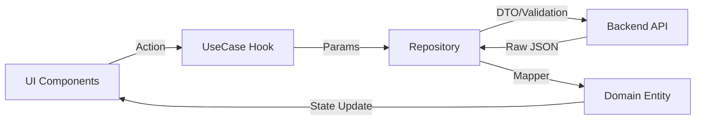

# 📋 Contributor's Guide & Technical Analysis

Welcome to the AxeCode contributor's guide! This document contains the in-depth technical architecture and workflow analysis to help you understand how the application works.

---

## 🛠️ 1. Complete Tech Stack

### Core Technologies
- **Framework**: [React 19](https://react.dev/)
- **Build Tool**: [Vite 7](https://vitejs.dev/)
- **State Management**: [Redux Toolkit](https://redux-toolkit.js.org/)
- **Routing**: [React Router 6.27](https://reactrouter.com/)

### UI & UX
- **Styling**: [Tailwind CSS 4.x](https://tailwindcss.com/)
- **Visual Flow**: [@xyflow/react](https://reactflow.dev/) (Interactive Flow Diagrams)
- **Editor**: Monaco Editor (Code) & Tiptap (Rich Text)
- **Icons**: Lucide React & FontAwesome

### Specialized Services
- **Real-time**: Socket.io-client
- **Video/Live Stream**: Video.js, HLS.js, Agora RTC
- **Validation**: Validator, Zod, and XSS (for sanitization)

---

## 🏗️ 2. Architecture & File Structure

AxeCode follows a **Clean Architecture** pattern to isolate business logic from UI and infrastructure.

### Directory Mapping
- **`src/domain`**: The "Heart" of the app. Contains Entities, UseCases, and Mappers. Pure business logic.
- **`src/infrastructure`**: External world communication. Contains Repositories, DTOs, and global Stores.
- **`src/presentation`**: The UI layer. Divided into `feature` (business modules) and `shared` (reusable components).
- **`src/core`**: Foundation layer. Utilities, Hooks, Constants, and Validation.

---

## 🔄 3. Data & Process Flow

### Phases of Operation
1. **Presentation Phase**: User interaction triggers a handler in a React component.
2. **UseCase Initiation**: The component calls the `execute` method of a UseCase hook (managed by `useAsyncUseCase`).
3. **Data Packaging (DTO)**: The Repository wraps the input data in a **Data Transfer Object** for validation and schema enforcement.
4. **Infrastructure Call**: The `apiClient` executes the network request.
5. **Domain Transformation**: The Repository passes JSON to a **Mapper**, which returns a pure **Domain Entity**.
6. **State Update**: The UseCase hook updates the reactive state, triggering a UI re-render.

### Visual Data Flow

---

## 🛠️ 4. Coding Guidelines

To maintain code quality, every contributor must follow these rules:

- **Layer Boundaries**: Do not import UI components (`presentation`) into `domain` or `infrastructure`.
- **Logic Placement**: Business logic belongs in **UseCases**, not in React Components.
- **Data Integrity**: Always use DTOs for requests and Mappers for responses.
- **Styling**: Stick to the Tailwind CSS design system and avoid ad-hoc styles.

---

## 🧪 5. Testing Strategy
- Use **Vitest** for unit testing.
- Prioritize testing for `domain/useCase` and `core/utils`.
- UI testing should focus on critical user flows in `presentation/feature`.

---

> [!TIP]
> Always refer to the [README.md](./README.md) for local environment setup and installation.
