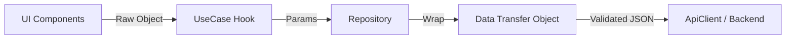
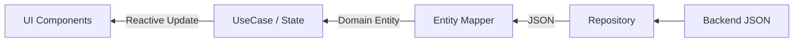

# AxeCode Frontend - Data & Process Flow Analysis

This document details how data moves through the application and the sequence of operations during a typical use case, following the Clean Architecture principles.

---

## 🔄 Process Flow (Sequential Logic)

The following steps describe the typical lifecycle of an operation (e.g., enrolling in a course or creating an article):

### 1. Presentation Layer (Trigger)
- **Action**: A user clicks a button or submits a form.
- **Handler**: The component calls an action from a **UseCase Hook** (e.g., `createUserEntitlement`).

### 2. UseCase Layer (Intent & Orchestration)
- **State Init**: The `useAsyncUseCase` hook sets `inProgress: true` and clears previous errors.
- **Logic**: The UseCase calls the corresponding method in the **Repository**.
- **Isolation**: The UseCase doesn't know about APIs or Fetch; it only knows about the Repository interface.

### 3. Infrastructure Layer (Implementation)
- **DTO Creation**: The Repository packages raw UI data into a **Data Transfer Object (DTO)** (e.g., `ArticleRequest`).
- **Validation**: The DTO performs self-validation (schema checks) before the network call.
- **API Call**: The Repository uses the `apiClient` to send an authenticated HTTP request.

### 4. Response & Transformation
- **Network Response**: Raw JSON is received from the backend.
- **Mapping**: Data is passed through an **EntityMapper** to transform backend-specific field names into Clean Domain Entities.
- **Success/Failure**: The Repository returns the final entity to the UseCase.

### 5. Presentation Layer (Feedback)
- **State Update**: `useAsyncUseCase` updates the `returnedData` and sets `inProgress: false`.
- **UI Update**: The component reacts to the state change (e.g., showing a success toast or navigating to a new page).

---

## 📊 Data Flow (Architecture Mapping)

The application maintains a strict directional flow to ensure data integrity.

### Outgoing Data (Request Path)

### Incoming Data (Response Path)

---

## 🛠️ Key Flow Components

| Component | Responsibility |
| :--- | :--- |
| **useAsyncUseCase** | Manages the `loading`, `error`, and `data` states globally for any async action. |
| **repositoryRegistry** | Decouples the technical implementation of the API client from the repositories. |
| **DTOs** | Ensures that data sent to the server is formatted correctly according to the API contract. |
| **Mappers** | Prevents backend changes from breaking the UI by decoupling backend keys from frontend properties. |
