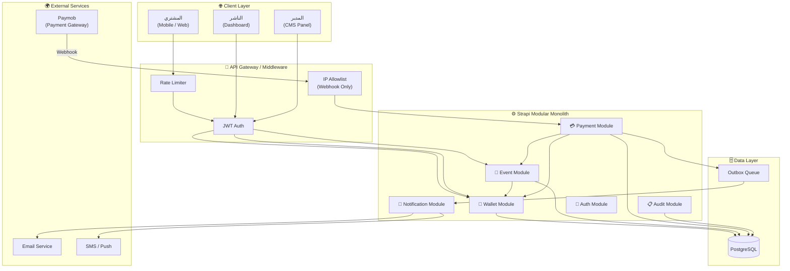
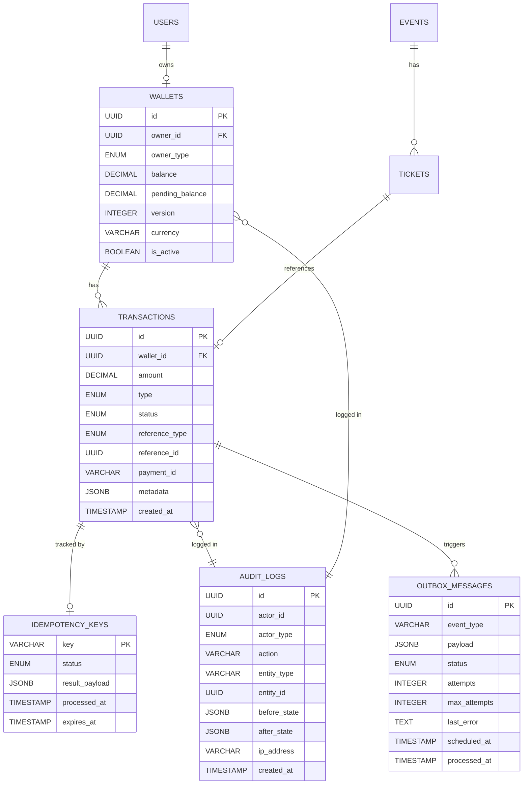
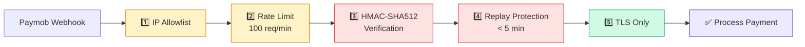
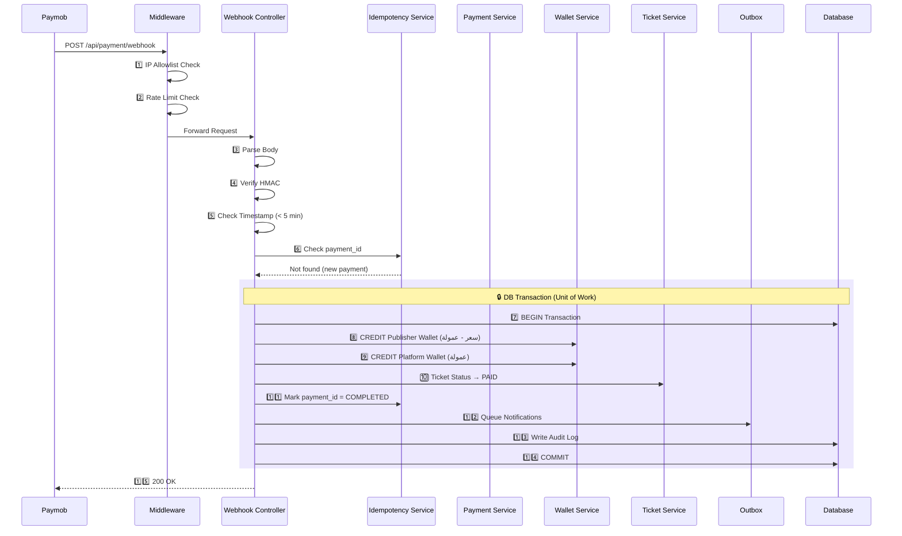
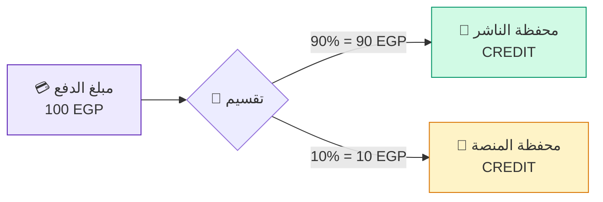
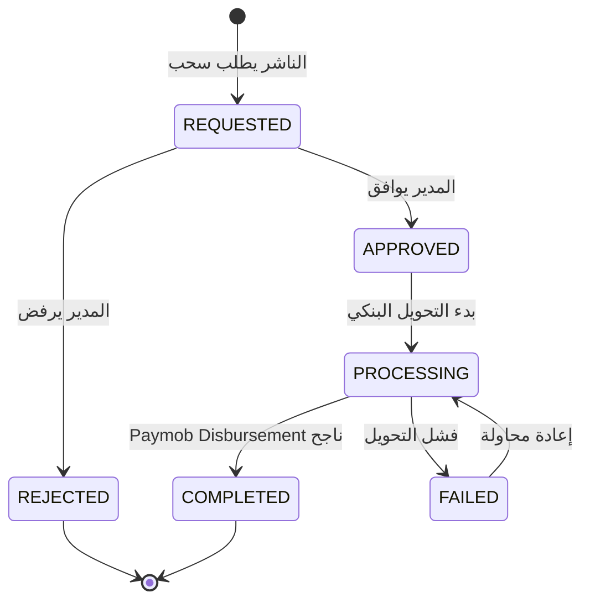
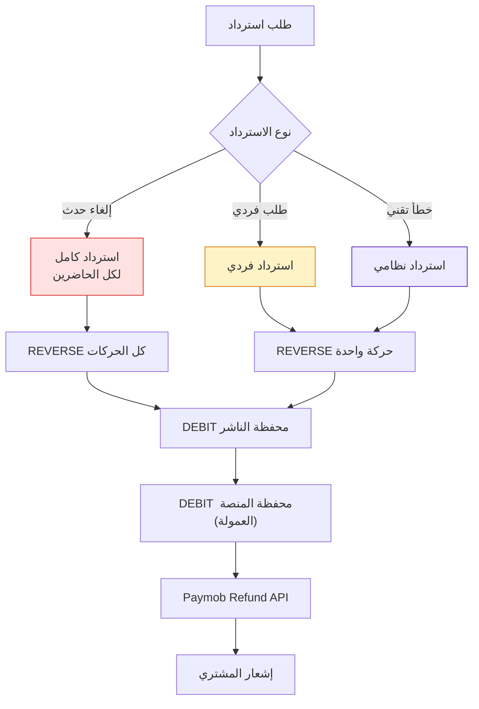

# 💳 Wallet & Payment System Design

> **نظام المحافظ والمدفوعات — Strapi CMS Customized Feature**

| المعلومة | القيمة |
|---|---|
| **النمط المعماري** | Modular Monolith داخل Strapi CMS |
| **بوابة الدفع** | Paymob (Webhooks + Disbursements API) |
| **قاعدة البيانات** | PostgreSQL مع Optimistic + Pessimistic Locking |
| **Background Jobs** | Strapi Cron + Custom Queue (Outbox Pattern) |
| **الإطار** | Strapi v4/v5 — TypeScript |
| **الإصدار** | v2.0 — 2025 |
| **الحالة** | System Design — للمراجعة والتنفيذ |

---

## جدول المحتويات

1. [البنية المعمارية (Architecture Overview)](#1-البنية-المعمارية-architecture-overview)
2. [هيكل الملفات (File Structure)](#2-هيكل-الملفات-file-structure)
3. [تصميم قاعدة البيانات (Data Schema)](#3-تصميم-قاعدة-البيانات-data-schema)
4. [طبقة الأمان (Security Layer)](#4-طبقة-الأمان-security-layer)
5. [تدفق المدفوعات (Payment Flow)](#5-تدفق-المدفوعات-payment-flow)
6. [نظام العمولات (Commission System)](#6-نظام-العمولات-commission-system)
7. [نظام السحب (Payout System)](#7-نظام-السحب-payout-system)
8. [نظام الاسترداد (Refund Flow)](#8-نظام-الاسترداد-refund-flow)
9. [نظام المطابقة (Reconciliation)](#9-نظام-المطابقة-reconciliation)
10. [المراقبة والتنبيهات (Monitoring & Observability)](#10-المراقبة-والتنبيهات-monitoring--observability)
11. [خطة التنفيذ (Implementation Roadmap)](#11-خطة-التنفيذ-implementation-roadmap)

---

## 1. البنية المعمارية (Architecture Overview)

نعتمد نمط **Modular Monolith** داخل Strapi، حيث كل وحدة وظيفية (Module) مستقلة منطقياً لكنها تشارك نفس Process وقاعدة البيانات. هذا يتيح سهولة الاستبدال مستقبلاً لأي وحدة بـ Microservice مستقل دون إعادة كتابة كاملة.

### 1.1 المبادئ الأساسية

| المبدأ | الوصف |
|---|---|
| **Immutable Ledger** | كل حركة مالية تُسجَّل ولا تُعدَّل — Append Only |
| **Idempotency First** | كل عملية دفع تُعالَج مرة واحدة فقط مهما تكررت |
| **Fail Safe** | الفشل لا يُنتج حالة غير متسقة (Atomic Transactions) |
| **Defense in Depth** | أمان متعدد الطبقات (HMAC + Auth + Rate Limit) |
| **Observable** | كل حدث مهم يُسجَّل ويُراقَب |

### 1.2 نظرة عامة على الـ Architecture



### 1.3 الوحدات الوظيفية

| الوحدة | المسؤولية | التبعيات |
|---|---|---|
| **Event Module** | بيانات الفعاليات، إصدار التذاكر، QR Codes | Wallet Module (via Events) |
| **Payment Module** | استقبال Webhooks، التحقق HMAC، Idempotency | Wallet Module, Event Module |
| **Wallet Module** | الأرصدة، Ledger، العمولات، Payouts | لا تبعيات خارجية |
| **Notification Module** | إيميل، QR، إشعارات | Outbox Pattern فقط |
| **Auth Module** | JWT، RBAC، Publisher Isolation | كل الوحدات |
| **Audit Module** | سجل التعديلات — من غيَّر ماذا متى | كل الوحدات |

> **⚠️ قاعدة حرجة:** الـ Wallet Module لا تعتمد على أي وحدة أخرى — كل الوحدات الأخرى هي التي تستدعيها. هذا يضمن أنها تبقى stateless و testable بشكل مستقل.

---

## 2. هيكل الملفات (File Structure)

البنية موافقة لـ Strapi v4/v5 مع استخدام `src/extensions` و `src/api` لكل module بشكل مستقل.

```
src/
├── api/                              # Strapi Content Types
│   ├── event/                        # 📅 فعاليات
│   │   ├── content-types/
│   │   │   └── event/schema.json
│   │   ├── controllers/event.ts
│   │   ├── routes/event.ts
│   │   └── services/event.ts
│   │
│   ├── ticket/                       # 🎫 تذاكر
│   │   ├── content-types/ticket/schema.json
│   │   ├── controllers/ticket.ts
│   │   ├── routes/ticket.ts
│   │   └── services/ticket.ts
│   │
│   ├── wallet/                       # 👛 محافظ
│   │   ├── content-types/wallet/schema.json
│   │   ├── controllers/wallet.ts
│   │   ├── routes/wallet.ts
│   │   └── services/
│   │       ├── wallet.ts             # الرصيد والعمليات الأساسية
│   │       └── wallet-payout.ts      # منطق السحب
│   │
│   ├── transaction/                  # 📒 سجل الحركات (Ledger)
│   │   ├── content-types/transaction/schema.json
│   │   ├── controllers/transaction.ts
│   │   └── services/transaction.ts
│   │
│   └── payment/                      # 💳 وسيط Paymob
│       ├── content-types/
│       │   ├── idempotency-key/schema.json
│       │   └── outbox-message/schema.json
│       ├── controllers/
│       │   └── webhook.ts            # POST /api/payment/webhook
│       ├── routes/webhook.ts
│       └── services/
│           ├── payment.ts            # منطق المعالجة الرئيسي
│           ├── hmac.ts               # التحقق من Paymob Signature
│           └── idempotency.ts        # فحص التكرار
│
├── extensions/                       # تخصيص Strapi Core
│   ├── users-permissions/
│   │   └── strapi-server.ts          # إضافة Publisher Role
│   └── content-manager/
│       └── strapi-server.ts
│
└── plugins/
    └── wallet-dashboard/             # 📊 لوحة تحكم Reconciliation
        ├── admin/src/
        │   ├── pages/
        │   │   ├── Reconciliation.tsx
        │   │   └── WalletOverview.tsx
        │   └── index.ts
        └── server/
            ├── controllers/reconciliation.ts
            ├── routes/index.ts
            └── services/reconciliation.ts

config/
├── middlewares.ts                    # Rate Limiting + IP Allowlist
├── cron-tasks.ts                     # Outbox Worker + Reconciliation Cron
└── plugins.ts

database/
├── migrations/
│   ├── 001_create_wallets.ts
│   ├── 002_create_transactions.ts
│   ├── 003_create_idempotency_keys.ts
│   ├── 004_create_outbox_messages.ts
│   └── 005_create_audit_logs.ts
└── seeds/
    └── admin-wallet.ts

tests/
├── unit/
│   ├── hmac.test.ts
│   ├── idempotency.test.ts
│   └── wallet-balance.test.ts
├── integration/
│   ├── webhook-flow.test.ts
│   ├── concurrent-payments.test.ts
│   └── reconciliation.test.ts
└── e2e/
    ├── full-payment-journey.test.ts
    └── refund-flow.test.ts
```

---

## 3. تصميم قاعدة البيانات (Data Schema)

> **المبدأ الأساسي:** Immutable Ledger — كل حركة مالية تُضاف ولا تُعدَّل أبداً. الرصيد الحالي هو مجموع كل Transactions.

### 3.1 Entity Relationship Diagram



### 3.2 جدول Wallets

| الحقل | النوع | القيد | الوصف |
|---|---|---|---|
| `id` | UUID | PK | معرف فريد |
| `owner_id` | UUID | FK → users | مالك المحفظة (Publisher أو Admin) |
| `owner_type` | ENUM | `publisher \| platform` | نوع المالك |
| `balance` | DECIMAL(15,2) | NOT NULL DEFAULT 0 | الرصيد الحالي |
| `pending_balance` | DECIMAL(15,2) | NOT NULL DEFAULT 0 | رصيد معلق حتى انتهاء الحدث |
| `version` | INTEGER | NOT NULL DEFAULT 0 | للـ Optimistic Locking |
| `currency` | VARCHAR(3) | DEFAULT 'EGP' | العملة |
| `is_active` | BOOLEAN | DEFAULT true | تعطيل المحفظة |
| `created_at` | TIMESTAMP | NOT NULL | وقت الإنشاء |
| `updated_at` | TIMESTAMP | NOT NULL | آخر تحديث |

### 3.3 جدول Transactions (الـ Ledger)

| الحقل | النوع | الوصف |
|---|---|---|
| `id` | UUID PK | معرف الحركة |
| `wallet_id` | UUID FK | المحفظة المعنية |
| `amount` | DECIMAL(15,2) | المبلغ — دائماً موجب |
| `type` | ENUM | `CREDIT` (إيداع) \| `DEBIT` (خصم) |
| `status` | ENUM | `PENDING` \| `COMPLETED` \| `FAILED` \| `REVERSED` |
| `reference_type` | ENUM | `TICKET_PAYMENT` \| `REFUND` \| `PAYOUT` \| `COMMISSION` \| `ADJUSTMENT` |
| `reference_id` | UUID | ID الكيان المرجعي (Ticket, Refund...) |
| `payment_id` | VARCHAR | Paymob Transaction ID |
| `metadata` | JSONB | بيانات إضافية (event_id, ticket_count...) |
| `created_at` | TIMESTAMP | وقت تسجيل الحركة — **لا يُعدَّل أبداً** |

### 3.4 جدول IdempotencyKeys

| الحقل | النوع | الوصف |
|---|---|---|
| `key` | VARCHAR(255) PK | Paymob Transaction ID — المفتاح الفريد |
| `status` | ENUM | `PROCESSING` \| `COMPLETED` \| `FAILED` |
| `result_payload` | JSONB | نتيجة المعالجة للرد السريع |
| `processed_at` | TIMESTAMP | وقت الانتهاء |
| `expires_at` | TIMESTAMP | وقت انتهاء الصلاحية (7 أيام) |

### 3.5 جدول OutboxMessages

| الحقل | النوع | الوصف |
|---|---|---|
| `id` | UUID PK | معرف الرسالة |
| `event_type` | VARCHAR | `TICKET_ISSUED` \| `QR_SEND` \| `EMAIL_CONFIRM` \| `PAYOUT_NOTIFY` |
| `payload` | JSONB | البيانات المطلوبة للتنفيذ |
| `status` | ENUM | `PENDING` \| `PROCESSING` \| `DONE` \| `DEAD` |
| `attempts` | INTEGER | عدد محاولات التنفيذ |
| `max_attempts` | INTEGER | DEFAULT 5 — الحد الأقصى |
| `last_error` | TEXT | آخر خطأ — للتشخيص |
| `scheduled_at` | TIMESTAMP | موعد التنفيذ (للتأجيل) |
| `processed_at` | TIMESTAMP | وقت النجاح |

### 3.6 جدول AuditLogs

| الحقل | النوع | الوصف |
|---|---|---|
| `id` | UUID PK | معرف السجل |
| `actor_id` | UUID | من قام بالعملية |
| `actor_type` | ENUM | `SYSTEM` \| `ADMIN` \| `PUBLISHER` |
| `action` | VARCHAR | `WALLET_CREDIT` \| `WALLET_DEBIT` \| `MANUAL_ADJUSTMENT`... |
| `entity_type` | VARCHAR | `wallet` \| `transaction` \| `ticket` |
| `entity_id` | UUID | ID الكيان المتأثر |
| `before_state` | JSONB | الحالة قبل التغيير |
| `after_state` | JSONB | الحالة بعد التغيير |
| `ip_address` | VARCHAR | IP العميل |
| `created_at` | TIMESTAMP | وقت التسجيل |

---

## 4. طبقة الأمان (Security Layer)

### 4.1 Authentication & Authorization

نستخدم Strapi Users-Permissions مع تمديده لإضافة Publisher Role وقواعد Ownership صارمة.

| الـ Role | الصلاحيات |
|---|---|
| **Admin (Platform)** | رؤية كل المحافظ — تعديل يدوي — Reconciliation — Payouts |
| **Publisher** | رؤية محفظته فقط — طلب سحب — رؤية تذاكر أحداثه فقط |
| **System (Webhook)** | Endpoint مخصص بدون JWT — محمي بـ HMAC + IP Allowlist |
| **Public** | شراء تذاكر — لا وصول لأي بيانات مالية |

> **⚠️ قاعدة Ownership:** كل Publisher يرى **فقط** البيانات المرتبطة بـ `owner_id` الخاص به. أي محاولة وصول لبيانات Publisher آخر تُحجب على مستوى الـ Service Layer.

### 4.2 Webhook Security — متعدد الطبقات



| الطبقة | الوصف |
|---|---|
| **IP Allowlist** | رفض أي طلب ليس من عناوين Paymob المعروفة |
| **HMAC-SHA512** | التحقق من Signature في كل طلب |
| **Rate Limiting** | 100 request/minute على الـ Webhook Endpoint |
| **Replay Protection** | رفض Webhook أقدم من 5 دقائق (timestamp check) |
| **TLS Only** | رفض الاتصالات غير المشفرة |

#### HMAC Verification Code

```typescript
// src/api/payment/services/hmac.ts
import crypto from 'crypto';

export function verifyPaymobHMAC(
  payload: Record<string, unknown>,
  receivedHmac: string,
  secret: string
): boolean {
  // استخراج الحقول المطلوبة بالترتيب الذي يحدده Paymob
  const concatenated = [
    payload.amount_cents,
    payload.created_at,
    payload.currency,
    payload.error_occured,
    payload.has_parent_transaction,
    payload.id,
    payload.integration_id,
    payload.is_3d_secure,
    payload.is_auth,
    payload.is_capture,
    payload.is_refunded,
    payload.is_standalone_payment,
    payload.is_voided,
    payload.order_id,
    payload.owner,
    payload.pending,
    payload['source_data.pan'],
    payload['source_data.sub_type'],
    payload['source_data.type'],
    payload.success,
  ].join('');

  const expected = crypto
    .createHmac('sha512', secret)
    .update(concatenated)
    .digest('hex');

  // Timing-safe comparison — يمنع Timing Attacks
  return crypto.timingSafeEqual(
    Buffer.from(expected),
    Buffer.from(receivedHmac)
  );
}
```

### 4.3 Concurrency Control — استراتيجية القفل

نستخدم **Optimistic Locking** كأساس مع **Pessimistic Locking** في حالات التعارض العالي.

| النمط | الاستخدام | آلية العمل |
|---|---|---|
| **Optimistic Locking** | CREDIT العادي (Webhook) | Version check — retry on conflict |
| **Pessimistic Locking** | DEBIT / Payout (سحب) | `SELECT FOR UPDATE` — يقفل الصف |

```typescript
// src/api/wallet/services/wallet.ts

// ═══ Optimistic Locking — الحالة العادية ═══
async function creditWallet(walletId: string, amount: number, trx: Knex.Transaction) {
  const wallet = await trx('wallets').where({ id: walletId }).first();

  const updated = await trx('wallets')
    .where({ id: walletId, version: wallet.version }) // شرط الـ Version
    .increment('balance', amount)
    .increment('version', 1);

  if (updated === 0) {
    // تعارض — محاولة أخرى بـ Exponential Backoff
    throw new OptimisticLockError('Wallet was modified concurrently');
  }
}

// ═══ Pessimistic Locking — للـ High Contention (Payout) ═══
async function debitWalletSafe(walletId: string, amount: number, trx: Knex.Transaction) {
  const wallet = await trx('wallets')
    .where({ id: walletId })
    .forUpdate()  // SELECT FOR UPDATE — يقفل الصف
    .first();

  if (wallet.balance < amount) {
    throw new InsufficientFundsError();
  }

  await trx('wallets')
    .where({ id: walletId })
    .decrement('balance', amount)
    .increment('version', 1);
}
```

---

## 5. تدفق المدفوعات (Payment Flow)

### 5.1 Happy Path — العملية الناجحة



### 5.2 جدول الخطوات التفصيلي

| # | المكون | الإجراء | في حالة الفشل |
|---|---|---|---|
| 1 | Middleware | IP Allowlist Check — رفض ما ليس من Paymob | `403 Forbidden` |
| 2 | Middleware | Rate Limit Check — 100 req/min | `429 Too Many Requests` |
| 3 | WebhookController | استقبال الطلب + Parse Body | `400 Bad Request` |
| 4 | HmacService | التحقق من HMAC Signature | `401 Unauthorized` |
| 5 | HmacService | التحقق من Timestamp — أقل من 5 دقائق | `401 Replay Attack` |
| 6 | IdempotencyService | فحص هل payment_id موجود مسبقاً | `200 OK` (الرد المحفوظ) |
| 7 | DB Transaction | بداية Unit of Work الذري | Rollback تلقائي |
| 8 | WalletService | CREDIT محفظة الناشر (السعر - العمولة) | Rollback + Retry |
| 9 | WalletService | CREDIT محفظة المنصة (العمولة) | Rollback + Retry |
| 10 | TicketService | تغيير حالة التذكرة → PAID | Rollback + Retry |
| 11 | IdempotencyService | تسجيل payment_id كـ COMPLETED | Rollback + Retry |
| 12 | OutboxService | إضافة مهام الإشعارات للـ Outbox | Rollback + Retry |
| 13 | AuditService | تسجيل العملية في AuditLog | Non-blocking |
| 14 | DB Commit | تثبيت كل التغييرات | Rollback |
| 15 | WebhookController | الرد بـ `200 OK` لـ Paymob | — |

### 5.3 Webhook Controller — الكود الرئيسي

```typescript
// src/api/payment/controllers/webhook.ts
export default {
  async handlePaymob(ctx: Context) {
    const body = ctx.request.body;
    const hmac = ctx.query.hmac as string;

    // ── أمان ─────────────────────────────────────────────
    if (!verifyPaymobHMAC(body, hmac, process.env.PAYMOB_HMAC_SECRET)) {
      return ctx.unauthorized('Invalid HMAC signature');
    }

    // فحص الـ Timestamp — حماية من Replay Attacks
    const webhookAge = Date.now() - new Date(body.created_at).getTime();
    if (webhookAge > 5 * 60 * 1000) {
      return ctx.unauthorized('Webhook too old — possible replay attack');
    }

    // معالجة حالات النجاح فقط
    if (!body.success) {
      strapi.log.info(`Payment failed: ${body.id} — skipping`);
      return ctx.send({ received: true });
    }

    // ── Idempotency ──────────────────────────────────────
    const existing = await strapi.service('api::payment.idempotency')
      .findByKey(body.id);

    if (existing?.status === 'COMPLETED') {
      return ctx.send(existing.result_payload); // الرد المحفوظ
    }

    if (existing?.status === 'PROCESSING') {
      return ctx.send({ status: 'processing' }); // تجنب التوازي
    }

    // ── Unit of Work ─────────────────────────────────────
    try {
      await strapi.db.transaction(async (trx) => {
        await strapi.service('api::payment.idempotency')
          .markProcessing(body.id, trx);

        await strapi.service('api::payment.payment')
          .processSuccessfulPayment(body, trx);
      });

      ctx.send({ status: 'ok' });
    } catch (error) {
      strapi.log.error('Webhook processing failed', { error, paymentId: body.id });
      ctx.internalServerError('Processing failed — will retry');
    }
  },
};
```

---

## 6. نظام العمولات (Commission System)

### 6.1 آلية احتساب العمولة

عند كل عملية شراء تذكرة ناجحة، يتم تقسيم المبلغ بين محفظة الناشر ومحفظة المنصة.



### 6.2 قواعد العمولة

| الحالة | نسبة المنصة | نسبة الناشر | ملاحظة |
|---|---|---|---|
| **دفع عادي** | 10% | 90% | النسبة الافتراضية |
| **ناشر مميز (Premium)** | 5% | 95% | عقد خاص |
| **تذكرة مجانية** | 0 | 0 | لا عمولة — لا حركة مالية |
| **كود خصم** | 10% من المبلغ بعد الخصم | 90% من المبلغ بعد الخصم | العمولة على المبلغ الفعلي |

### 6.3 Commission Calculation

```typescript
// src/api/payment/services/payment.ts
interface CommissionResult {
  publisherAmount: number;
  platformAmount: number;
  commissionRate: number;
}

function calculateCommission(totalAmount: number, publisherId: string): CommissionResult {
  // يمكن تخصيص النسبة لكل ناشر عبر الإعدادات
  const commissionRate = getPublisherCommissionRate(publisherId); // default: 0.10

  const platformAmount = Math.round(totalAmount * commissionRate * 100) / 100;
  const publisherAmount = totalAmount - platformAmount;

  return { publisherAmount, platformAmount, commissionRate };
}
```

---

## 7. نظام السحب (Payout System)

### 7.1 تدفق طلب السحب



### 7.2 قواعد السحب

| القاعدة | القيمة | السبب |
|---|---|---|
| **الحد الأدنى للسحب** | 100 EGP | تجنب رسوم التحويل المرتفعة نسبياً |
| **الحد الأقصى اليومي** | 50,000 EGP | حماية من الاحتيال |
| **فترة الاحتجاز** | 7 أيام بعد انتهاء الحدث | حماية من الاستردادات |
| **الحالة المطلوبة** | محفظة نشطة + حساب بنكي مؤكد | KYC + Bank Verification |
| **الموافقة** | Admin Approval مطلوب | مراجعة يدوية لأول 3 عمليات |

### 7.3 Payout Processing Code

```typescript
// src/api/wallet/services/wallet-payout.ts
async function requestPayout(publisherId: string, amount: number) {
  return await strapi.db.transaction(async (trx) => {
    // 1. Pessimistic Lock — تأمين المحفظة
    const wallet = await trx('wallets')
      .where({ owner_id: publisherId, owner_type: 'publisher' })
      .forUpdate()
      .first();

    // 2. التحقق من الرصيد المتاح (balance - pending outgoing)
    const availableBalance = wallet.balance - wallet.pending_balance;
    if (availableBalance < amount) {
      throw new InsufficientFundsError(`Available: ${availableBalance}, Requested: ${amount}`);
    }

    // 3. حجز المبلغ (نقله من balance إلى pending)
    await trx('wallets')
      .where({ id: wallet.id })
      .decrement('balance', amount)
      .increment('version', 1);

    // 4. تسجيل حركة DEBIT في الـ Ledger
    await trx('transactions').insert({
      wallet_id: wallet.id,
      amount,
      type: 'DEBIT',
      status: 'PENDING',
      reference_type: 'PAYOUT',
      metadata: { publisher_id: publisherId },
    });

    // 5. Outbox — إشعار للمدير للموافقة
    await trx('outbox_messages').insert({
      event_type: 'PAYOUT_APPROVAL_NEEDED',
      payload: { wallet_id: wallet.id, amount, publisher_id: publisherId },
      status: 'PENDING',
    });
  });
}
```

---

## 8. نظام الاسترداد (Refund Flow)

### 8.1 حالات الاسترداد



### 8.2 قواعد الاسترداد

| القاعدة | القيمة |
|---|---|
| **المدة المسموحة** | حتى 24 ساعة قبل بدء الحدث |
| **الاسترداد بعد الإلغاء** | تلقائي لكل التذاكر |
| **الاسترداد الجزئي** | مدعوم — بموافقة Admin |
| **العمولة عند الاسترداد** | تُعاد كاملة (المنصة تتحمل) |

---

## 9. نظام المطابقة (Reconciliation)

### 9.1 الهدف

ضمان أن الأرصدة في قاعدة بياناتنا تتطابق مع سجلات Paymob ومع الحسابات الفعلية.

### 9.2 أنواع المطابقة

| النوع | التكرار | الآلية |
|---|---|---|
| **Internal Reconciliation** | كل ساعة (Cron) | `SUM(transactions) == wallet.balance` لكل محفظة |
| **External Reconciliation** | يومي | مقارنة سجلاتنا بتقارير Paymob CSV |
| **Manual Reconciliation** | عند الحاجة | Admin يراجع الفروقات عبر Dashboard |

### 9.3 Internal Reconciliation Logic

```typescript
// src/plugins/wallet-dashboard/server/services/reconciliation.ts
async function runInternalReconciliation() {
  const wallets = await strapi.db.query('api::wallet.wallet').findMany();

  const discrepancies = [];

  for (const wallet of wallets) {
    const sumResult = await strapi.db.connection('transactions')
      .where({ wallet_id: wallet.id, status: 'COMPLETED' })
      .select(
        strapi.db.connection.raw(`
          SUM(CASE WHEN type = 'CREDIT' THEN amount ELSE 0 END) as total_credits,
          SUM(CASE WHEN type = 'DEBIT' THEN amount ELSE 0 END) as total_debits
        `)
      )
      .first();

    const calculatedBalance = (sumResult.total_credits || 0) - (sumResult.total_debits || 0);

    if (Math.abs(calculatedBalance - wallet.balance) > 0.01) {
      discrepancies.push({
        wallet_id: wallet.id,
        stored_balance: wallet.balance,
        calculated_balance: calculatedBalance,
        difference: calculatedBalance - wallet.balance,
      });

      // تسجيل في Audit Log
      await strapi.service('api::audit.audit').log({
        action: 'RECONCILIATION_MISMATCH',
        entity_type: 'wallet',
        entity_id: wallet.id,
        metadata: { stored: wallet.balance, calculated: calculatedBalance },
      });
    }
  }

  return discrepancies;
}
```

### 9.4 Cron Configuration

```typescript
// config/cron-tasks.ts
export default {
  // Outbox Worker — كل 30 ثانية
  '*/30 * * * * *': async ({ strapi }) => {
    await strapi.service('api::payment.outbox').processQueue();
  },

  // Internal Reconciliation — كل ساعة
  '0 * * * *': async ({ strapi }) => {
    const result = await strapi.service('plugin::wallet-dashboard.reconciliation')
      .runInternalReconciliation();

    if (result.length > 0) {
      strapi.log.warn(`Reconciliation found ${result.length} discrepancies`);
      // إرسال تنبيه للمديرين
    }
  },

  // Cleanup expired idempotency keys — يومياً
  '0 3 * * *': async ({ strapi }) => {
    await strapi.service('api::payment.idempotency').cleanupExpired();
  },

  // Dead letter queue processor — كل 5 دقائق
  '*/5 * * * *': async ({ strapi }) => {
    await strapi.service('api::payment.outbox').processDeadLetters();
  },
};
```

---

## 10. المراقبة والتنبيهات (Monitoring & Observability)

### 10.1 مقاييس الأداء الرئيسية (KPIs)

| المقياس | الوصف | العتبة الحرجة |
|---|---|---|
| **Webhook Response Time** | زمن معالجة الـ Webhook | > 5 ثوانٍ |
| **Failed Payment Rate** | نسبة المدفوعات الفاشلة | > 5% |
| **Reconciliation Mismatches** | عدد الفروقات في المطابقة | > 0 |
| **Outbox Queue Depth** | عدد الرسائل المعلقة | > 100 |
| **Dead Letters Count** | رسائل فاشلة نهائياً | > 0 |
| **Wallet Lock Contention** | عدد محاولات الـ Retry بسبب Optimistic Lock | > 10/min |

### 10.2 نقاط التسجيل (Logging Points)

```typescript
// كل نقطة تسجيل مهمة في النظام
const LOGGING_POINTS = {
  // Payment Flow
  'webhook.received':        'info',    // استقبال Webhook
  'webhook.hmac_failed':     'warn',    // فشل HMAC
  'webhook.replay_detected': 'warn',    // محاولة إعادة
  'webhook.duplicate':       'info',    // طلب مكرر (idempotent)
  'webhook.processing':      'info',    // بدء المعالجة
  'webhook.success':         'info',    // نجاح المعالجة
  'webhook.failed':          'error',   // فشل المعالجة

  // Wallet Operations
  'wallet.credit':           'info',    // إيداع
  'wallet.debit':            'info',    // خصم
  'wallet.lock_conflict':    'warn',    // تعارض Optimistic Lock
  'wallet.insufficient':     'warn',    // رصيد غير كافٍ

  // Payout
  'payout.requested':        'info',    // طلب سحب جديد
  'payout.approved':         'info',    // موافقة
  'payout.disbursed':        'info',    // تحويل ناجح
  'payout.failed':           'error',   // فشل التحويل

  // Reconciliation
  'reconciliation.started':  'info',    // بدء المطابقة
  'reconciliation.mismatch': 'error',   // فرق في الأرصدة
  'reconciliation.clean':    'info',    // كل شيء متطابق
};
```

### 10.3 هيكل التنبيهات

| الحدث | القناة | المستلم |
|---|---|---|
| فشل HMAC متكرر | Email + Slack | فريق الأمان |
| فرق في المطابقة | Email + Dashboard Alert | المدير المالي |
| Outbox Dead Letter | Slack | فريق التطوير |
| فشل Payout | Email | المدير + الناشر |
| Rate Limit مرتفع | Dashboard Alert | فريق DevOps |

---

## 11. خطة التنفيذ (Implementation Roadmap)

### Phase 1: Foundation (الأسبوع 1-2)

- [ ] إنشاء Content Types في Strapi (Wallet, Transaction, IdempotencyKey)
- [ ] إنشاء Migrations لقاعدة البيانات
- [ ] إعداد الـ Wallet Service (credit, debit, balance query)
- [ ] Unit Tests للـ Wallet operations

### Phase 2: Payment Integration (الأسبوع 3-4)

- [ ] Webhook endpoint + HMAC Verification
- [ ] Idempotency Service
- [ ] Payment processing flow (Unit of Work)
- [ ] Commission calculation
- [ ] Integration Tests للـ Webhook Flow

### Phase 3: Security & Reliability (الأسبوع 5)

- [ ] IP Allowlist middleware
- [ ] Rate Limiting
- [ ] Replay Protection
- [ ] Optimistic + Pessimistic Locking
- [ ] Outbox Pattern + Cron Worker
- [ ] Concurrent payment tests

### Phase 4: Payout & Refund (الأسبوع 6-7)

- [ ] Payout request flow
- [ ] Admin approval workflow
- [ ] Paymob Disbursements API integration
- [ ] Refund flow (full + partial)
- [ ] E2E Tests

### Phase 5: Dashboard & Monitoring (الأسبوع 8)

- [ ] Wallet Dashboard plugin (React)
- [ ] Reconciliation service + Cron
- [ ] Audit Log viewer
- [ ] Monitoring alerts setup
- [ ] External Reconciliation with Paymob CSV

---

> **📋 ملاحظة:** هذا المستند مستخرج ومُنقَّح من الملف الأصلي `wallet_system_design.md`، مع إضافة أقسام مفقودة (العمولات، السحب، الاسترداد، المطابقة، المراقبة، خطة التنفيذ) بناءً على الأنماط المعمارية الموجودة في التصميم الأصلي.
